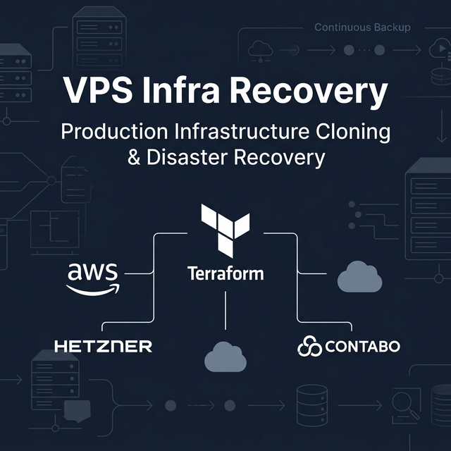
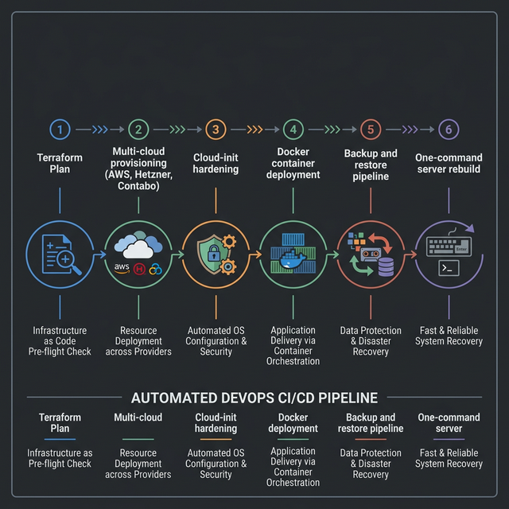
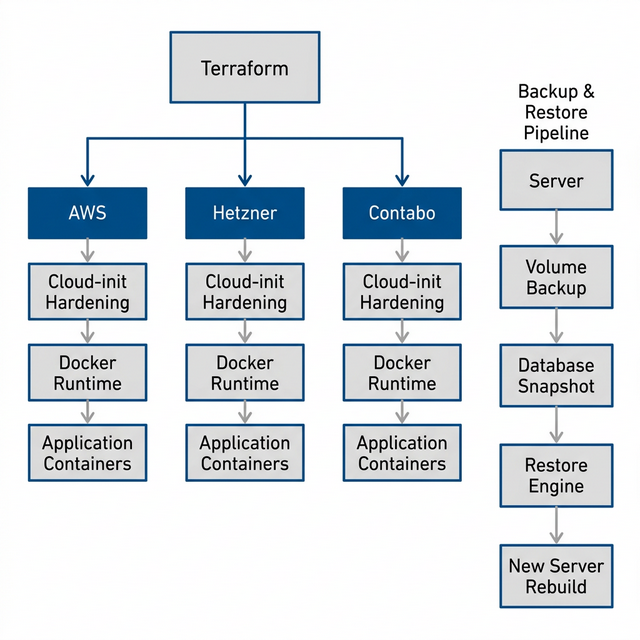
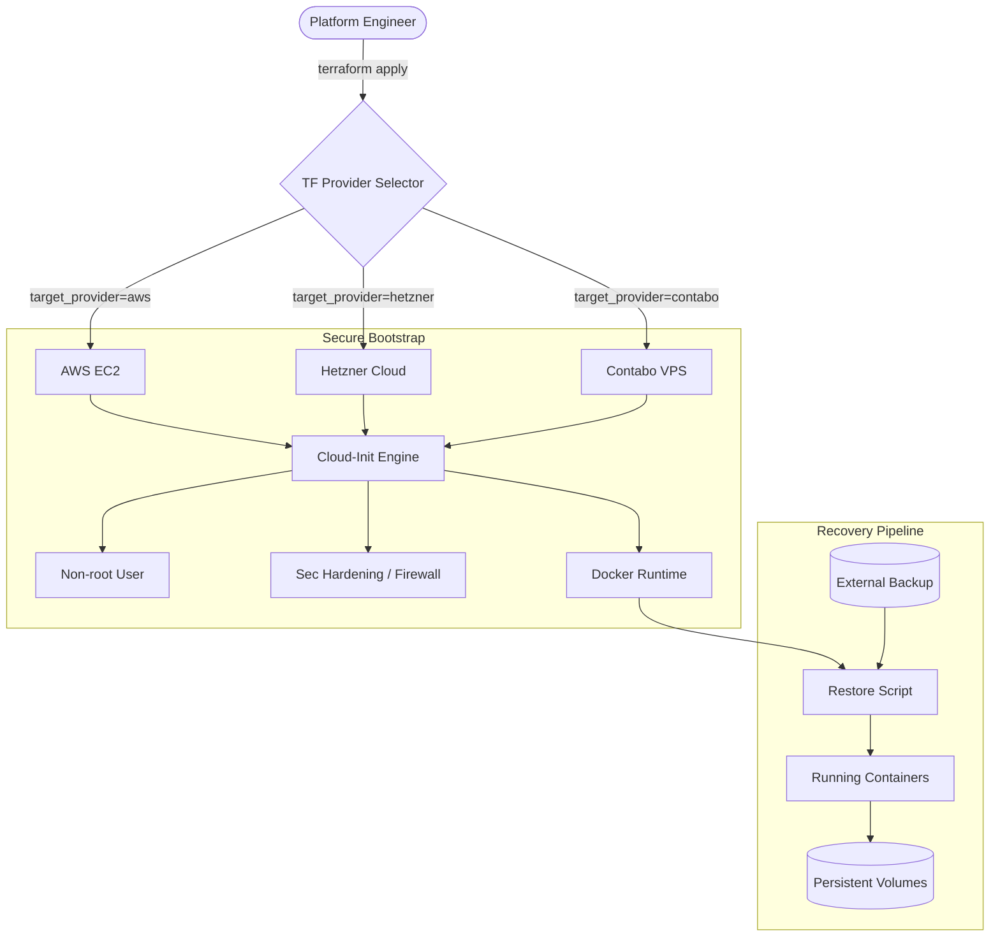

# 🌍 Multi-Cloud Infrastructure Cloner



[](https://www.terraform.io/)
[](https://en.wikipedia.org/wiki/Infrastructure_as_code)
[](https://en.wikipedia.org/wiki/Hardening_(computing))
[](https://github.com/abaasi256/vps-infra-recovery.git)
[](LICENSE)

## 🎯 Overview

The **Multi-Cloud Infrastructure Cloner** is a production-grade IaC system designed for high-availability and disaster recovery. It allows for the instantaneous recreation of a full production environment across multiple VPS providers (**AWS, Hetzner, Contabo**) with a single command.

### Key Capabilities

- **Provider Abstraction**: Interchangeable compute modules with a unified variable schema.
- **Secure-by-Default**: Automated cloud-init hardening, SSH-only access, and Fail2ban integration.
- **Atomic Restoration**: Custom backup engine to capture and redeploy Docker volumes and service states.
- **Zero-Leak Design**: Strict credential isolation and environment-specific configurations.

---

## 🏗 Architecture

### Pipeline Flow



### Architecture Detail



### System Flow (Mermaid)



---

## 🚀 Getting Started

### 1. Prerequisites

- HashiCorp Terraform 1.5+
- Cloud provider API credentials
- SSH Key Pair

### 2. Configure Environment

Clone the `.env.example` and fill in your secrets:

```bash
cp .env.example .env
source .env
```

### 3. Deploy

```bash
cd infra/terraform/environments/prod
terraform init
terraform apply -var="target_provider=hetzner" -var="ssh_public_key=$(cat ~/.ssh/id_rsa.pub)"
```

---

## 🛡 Security Model

- **Identity**: No root login. All operations performed via `sudo` users.
- **Network**: Minimal exposure. UFW configured for SSH, HTTP, and HTTPS only.
- **Runtime**: Docker containers run with resource limits and restart policies.
- **Secrets**: Encrypted variable injection via Terraform environment variables.

> [!IMPORTANT]
> For a deep dive into our hardening process and zero-leak strategy, see the [Full Security Architecture](docs/SECURITY.md).

## 💾 Backup & Restore

### Capture

Run on the running server to export state:

```bash
./backup/scripts/capture.sh
```

### Restore

Run on the newly provisioned server:

```bash
./backup/scripts/restore.sh infra-export-YYYYMMDD.tar.gz
```

---

### 🏅 Portfolio Piece

By [abaasi256](https://github.com/abaasi256)